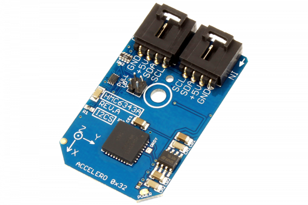

# HMC6343A

The Honeywell HMC6343 is a fully integrated compass module that includes firmware for heading computation and calibration for magnetic distortions.The module combines three-axis magneto-resistive sensor, three-axis MEMS accelerometer, analog and digital support circuits, a microprocessor and algorithms required for heading computation.
This Device is available from www.ncd.io 

[SKU: HMC6343A_I2CS]

(https://store.ncd.io/product/hmc6343-3-axis-compass-module-accelerometer-i2c-mini-module/)
This Sample code can be used with Arduino.

Hardware needed to interface HMC6343A sensor with Arduino

1. <a href="https://store.ncd.io/product/i2c-shield-for-arduino-nano/">Arduino Nano</a>

2. <a href="https://store.ncd.io/product/i2c-shield-for-arduino-micro-with-i2c-expansion-port/">Arduino Micro</a>

3. <a href="https://store.ncd.io/product/i2c-shield-for-arduino-uno/">Arduino uno</a>

4. <a href="https://store.ncd.io/product/dual-i2c-shield-for-arduino-due-with-modular-communications-interface/">Arduino Due</a>

5. <a href="https://store.ncd.io/product/hmc6343-3-axis-compass-module-accelerometer-i2c-mini-module/">HMC6343A 3Axis Compass and Accelometer Sensor</a>

6. <a href="https://store.ncd.io/product/i%C2%B2c-cable/">I2C Cable</a>

HMC6343A:

The Honeywell HMC6343 is a fully integrated compass module that includes firmware for heading computation and calibration for magnetic distortions.The module combines three-axis magneto-resistive sensor, three-axis MEMS accelerometer, analog and digital support circuits, a microprocessor and algorithms required for heading computation.

Applications:

• Mobile phones

• Consumer electronics

• Auto navigation systems

• Measure both direction and magnitude of Earth’s magnetic field.

How to Use the HMC6343A Arduino Library
The HMC6343A is very easy to interface as following.

1.Address calling:The following command is used to call the address of HMC6343A to start the transmission.

            hmc.getAddr_HMC6343A(HMC6343A_DEFAULT_ADDRESS);   // 0x19
            
2.Sensor setup:The following command is used to set the sensor for the purposes of accelometer and compass.

            hmc.setUpSensor();
            
3.Output measurement:The following command is used to measure the acceleration and magnetic vector.
            
            hmc.Measure_Sensor();

